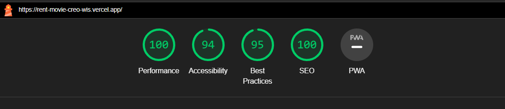

## Stack Used
- Next.js
- Tailwind CSS
- Redux


## Clone and run locally

1. You'll first need to fork this repository to your own GitHub account. You can then clone your fork of the repository locally:


2. Clone this repo and install dependencies

   ```bash
   git clone https://github.com/kamalika0363/rent-movie-creo-wis.git
   ```
3. Install dependencies with npm or yarn (I used npm)   
      ```bash
   npm install
   ```

3. Use `cd` to change into the app's directory

   ```bash
   cd rent-movie-creo-wis
   ```
   
4. You can now run the Next.js local development server:

   ```bash
   npm run dev
   ```

   The app should now be running on [localhost:3000](http://localhost:3000/).

## Some Stats
